<p align="center">
  
  
  
  
  
  
</p>

# MonQuest — Monad-native, AI-judged bounty marketplace

**Post a technical bounty. Hunters submit markdown + screenshots. Gemini writes the review. The winner is paid on-chain — and every step that costs money is verified on Monad before it counts.**

A payments app first: bounty creation runs through the **x402** micro-payment protocol (a 0.001 MON platform fee, verified on-chain), and winner payouts are validated against the winning submission before a bounty ever flips to `PAID`.

> **What is x402?** An HTTP payment protocol: a server replies `402 Payment Required` plus machine-readable payment details, the client pays in native crypto, then re-requests with the transaction hash as proof. No API keys, no credit cards — settlement happens on the chain you're already on (here: Monad Testnet).

### Three things that make MonQuest different

- **Monad-native settlement** — a 0.001 MON platform fee gates bounty creation via x402; every fee and payout tx is checked on-chain (recipient, amount, receipt) before the server records it.
- **AI-judged submissions** — creators run one-click audits where **Gemini 2.5 Flash** streams a ranked top-3 with per-submission feedback, configures which submissions score highest.
- **Real wallet UX** — Privy embedded wallets (created on login, defaulting to Monad Testnet), a wrong-network guard with one-click chain switch, and a full payment state machine (awaiting → verifying → success → retry).

---

## How it works

```mermaid
flowchart LR
  A["Sign in · Privy embedded wallet"] --> B["Create bounty form"]
  B --> C["POST /api/bounties → HTTP 402 + payment details"]
  C --> D["Send 0.001 MON to platform wallet"]
  D --> E["Re-POST with x-payment-hash · verify on Monad"]
  E --> F["Bounty OPEN"]
  F --> G["Hunters submit markdown + images"]
  G --> H["Creator runs AI audit · Gemini streams top-3"]
  H --> I["Creator pays winner on-chain"]
  I --> J["POST /api/bounties/payout · verify recipient & amount"]
  J --> K["Bounty PAID"]
```



In one breath:

1. **Sign in** — Privy creates an embedded wallet for you, pre-configured for Monad Testnet.
2. **Post a bounty** — the server returns an x402 challenge; pay **0.001 MON** to the platform wallet from your UI, and the bounty goes live as soon as the payment tx is confirmed.
3. **Hunters submit** — markdown descriptions with optional images, reviewed live with a markdown preview.
4. **Get judged & paid** — the creator runs an AI audit (Gemini streams a top-3 with feedback), picks a winner, and pays them wallet-to-wallet. The payout is verified on-chain before the bounty becomes `PAID`.

---

## Screenshots

<!-- TODO: capture — drop 4 PNGs in public/screenshots/ and delete this line -->

| | |
|---|---|
| `screenshots/landing.png` — hero landing: value prop, live stats, CTAs | `screenshots/bounties.png` — bounty registry list with prize + status pills |
| `screenshots/bounty-detail-ai-review.png` — detail page mid AI-audit with ranked top-3 + feedback | `screenshots/create-pay.png` — create flow showing the x402 wallet-panel (address, amount, tx state machine) |

> **TODO: capture** — each slot above is an image you must shoot on a running instance (see Quickstart). Replace the table with an `` grid and delete this note.

---

## Quickstart

> Recommended: Node.js 18+, a Privy project, a Supabase project, and a Google AI Studio API key. Foundry (`anvil`) is used by the local demo scripts.

```bash
git clone <your-repo-url> && cd Monquest
npm install
cp .env.example .env.local
```

### Required environment variables

| Variable | Required | Where to get it |
|----------|----------|-----------------|
| `NEXT_PUBLIC_PRIVY_APP_ID` | yes | Privy dashboard → your app → **Keys** (starts with `pub_`) |
| `NEXT_PUBLIC_PRIVY_CLIENT_ID` | no | same screen (starts with `client_`); used only when present |
| `NEXT_PUBLIC_PLATFORM_WALLET` | yes | your own **Monad Testnet** address — this is where the 0.001 MON fee is sent |
| `NEXT_PUBLIC_SUPABASE_URL` | yes | Supabase → **Project Settings → API → Project URL** |
| `NEXT_PUBLIC_SUPABASE_ANON_KEY` | yes | same screen → **anon public key** |
| `SUPABASE_SERVICE_ROLE_KEY` | yes | same screen → **service_role** key (**server-only**, never `NEXT_PUBLIC_`) |
| `GOOGLE_GEMINI_API_KEY` | yes | Google AI Studio → **Get API key** |
| `MONAD_RPC_URL` | no | optional override; defaults to `https://testnet-rpc.monad.xyz` |

The server validates the six required vars at boot (`app/lib/env.ts`) and throws a descriptive `MissingEnvError` with the names of whatever is missing.

### 1. Database — Supabase SQL Editor

Open your Supabase project → **SQL Editor**, then run the migrations **in order**:

1. `supabase/migrations/001_schema.sql` — `bounties` + `submissions` tables, RLS policies, public `media` storage bucket
2. `supabase/migrations/002_user_id.sql` — `user_id` on bounties/submissions, optional `users` table
3. `supabase/migrations/003_ai_review.sql` — `is_ai_selected` + `ai_feedback` on submissions
4. `supabase/migrations/004_winner.sql` — `winner_submission_id` on bounties
5. `supabase/migrations/005_pending_bounties.sql` — reconciliation table for paid-but-unsaved bounties

See [`supabase/README.md`](supabase/README.md) for details and a `supabase db push` alternative.

### 2. Privy — enable Monad Testnet ⚠️ REQUIRED

Privy dashboard → your app → **Embedded wallets → Networks** → toggle **Monad Testnet** (chain id **10143** / `0x279F`).

If this is skipped, embedded-wallet transactions silently fail — the app *sets* Monad as its chain in [`app/components/privy-provider.tsx`](app/components/privy-provider.tsx), but Privy will reject signing requests for an unconfigured network.

### 3. Run & fund

```bash
npm run dev        # → http://localhost:3000
```

Then grab testnet MON for the x402 fee from a Monad faucet — the native wallet panel in the app points at the explorer (the same explorer every tx in the app links to, [`https://testnet.monadexplorer.com`](https://testnet.monadexplorer.com)). Without a fauceted wallet you can still browse, submit, and run placeholder flows — only the *pay* steps need real MON.

---

## Demo scripts

All demos run from the repo root with `tsx` and read `.env.local` via `dotenv`.

| Command | What it does | Prerequisites |
|---------|--------------|---------------|
| `npm run demo` | EVM demo (local anvil default) **then** Solana demo | anvil for the EVM half; see `--local` note |
| `npm run demo:evm` | balance → send 0.001 ETH → optional contract reads (`get()`/`totalSupply`) | anvil on `:8545` (default) **or** `EVM_RPC_URL`/`EVM_CHAIN_ID`/`PRIVATE_KEY` |
| `npm run demo:solana` | devnet: airdrop 2 SOL → balance → send SOL | none (self-funds on devnet; `SOLANA_PRIVATE_KEY` optional); gracefully skips the send if the airdrop is rate-limited |
| `npm run chain:local` | starts **anvil** (`:8545`, chainId 31337) + **solana-test-validator** (`:8899`), PIDs in `.chain-pids` | Foundry (anvil) + Solana CLI (validator) |
| `npm run chain:stop` | stops what `chain:local` started | — |

Expected EVM output: deployer `0xf39F…`, `balance : 9999.99… ETH`, `sent 0.001 ETH → tx 0x…`, then `SimpleStorage.0xe7f1… get() = 42` and `MonQuestToken.0x9fE4… totalSupply = 1000000 MQ` (only if you deployed contracts first — see below).

> **Note on `--local`:** `npm run demo -- --local` points *both* halves at the local validators. It completes fully only when both anvil **and** `solana-test-validator` are running; on a machine with Foundry but no Solana CLI, the EVM half passes and the Solana half fails on the missing validator.

---

## Smart contracts & programs

Both are **bonus surfaces** — the core bounty flow needs neither one.

### `contracts/` — Hardhat (Solidity 0.8.24)

- **`MonQuestToken`** — ERC-20 `MQ` (18 decimals, initial supply 1,000,000), only-owner mint.
- **`SimpleStorage`** — set/get with an updater record; deployed with initial value `42`.

```bash
npm run contracts:test      # → 9 passing (MonQuestToken + SimpleStorage)
npm run contracts:deploy    # root shortcut for `cd contracts && npm run deploy`
cd contracts && npm run deploy:local      # target the running anvil (+ `deploy:sepolia` for testnet)
```

Deployed addresses are written to `contracts/deployments.json`, keyed by chainId — `npm run demo:evm` reads it for its optional contract step. Deploy **to the same anvil you're demoing against** for those reads to resolve.

### `solana-program/` — Anchor (Rust)

A minimal **permissioned counter** program (`monquest-counter`, anchor-lang 0.30) with a client-side IDL walkthrough — `initialize` sets the authority, `increment` bumps the count (authority only). Requires the Rust + Solana CLI toolchain:

```bash
cd solana-program && npm install
anchor build && anchor test      # or: npm run build / npm run test
```

See its [own README](solana-program/README.md) for prerequisites, program ID, and instruction docs.

---

## Architecture

```
Browser (Next.js 14 · App Router · TS)
│  Privy provider → embedded wallet on Monad Testnet (10143)
│  create/bounties/[id]/profile  pages · ui/ design-system components
▼
/app/api ──────────────────────────────────────────────────────────┐
  POST /api/bounties           x402: 402→pay→verify (viem, retry)   │
  POST /api/bounties/payout    verify winner tx before PAID        │
  POST /api/ai-review          Gemini 2.5 Flash stream → top-3     │
  GET  /api/bounties[/id]      bounty reads                        │
  GET  /api/blockchain/balances  EVM · SOL · BTC (bonus surface)   │
                                                                    ▼
                                                   Supabase (PostgreSQL)
                                                   bounties · submissions
                                                   users · pending_bounties
```

| Module | Role |
|--------|------|
| `app/components/privy-provider.tsx` | Privy app id/client id; default + supported chain = Monad Testnet |
| `app/api/bounties/route.ts` | x402 payment gate + on-chain verification (recipient, amount, receipt) |
| `app/api/bounties/payout/route.ts` | winner-payout verification before `markPaid` |
| `app/api/ai-review/route.ts` | Gemini 2.5 Flash content stream + ranked top-3 persistence |
| `app/lib/db.ts` | Supabase client (anon) + admin (service role) + typed queries |
| `app/lib/blockchain/config.ts` | chain config; `PLATFORM_FEE = 0.001` MON; Monad Testnet 10143 |
| `app/lib/blockchain/{evm,solana,btc}.ts` | multi-chain balances/sends (bonus surface) |

---

## Error handling & reliability

Payments route through a small, deliberate error taxonomy — every API returns `{ error, code, hint? }` and the client surfaces code + hint instead of raw server text.

| Code | HTTP | Meaning |
|------|------|---------|
| `PAYMENT_REQUIRED` | 402 | no payment hash — response body *is* the payment challenge (`paymentDetails`) |
| `TX_NOT_FOUND` / `TX_UNCONFIRMED` | 400 / 408 | tx not visible yet or still pending — retry with the same hash |
| `LOW_AMOUNT` / `BAD_RECIPIENT` | 400 | tx value below fee/prize, or wrong recipient |
| `TX_REVERTED` | 400 | payment executed but reverted on-chain |
| `RPC_UNAVAILABLE` | 503 | Monad RPC unreachable — **retried with backoff first** (3 attempts, 500 → 1250 ms) |
| `WRONG_NETWORK` | 400 | payout tx not sent on Monad Testnet (payout route) |
| `SUPABASE_MIGRATIONS_REQUIRED` | 503 | schema guard (`42P01`) wired to a human-readable "run the migrations" hint (dev-only) |
| `MISSING_*` | 400 | request-shape validation (fields, tx-hash format) |

Also enforced: **boot-time env validation** (`app/lib/env.ts`, throws `MissingEnvError` naming every absent var), receipt waits with a ~30 s timeout (public testnet RPCs lag — the server never hard-fails on a slow confirmation), and a `paid-but-not-saved` reconciliation path that parks a verified payment in `pending_bounties` if the DB insert ever fails.

---

## Roadmap & known limitations

Deliberate MVP choices, stated plainly:

- **Winner payout is client-initiated** — the browser sends `eth_sendTransaction`, then the server verifies the tx on-chain (recipient = winner's `hunter_address`, value ≥ prize, Monad Testnet) before flipping `PAID`. The server never holds prize custody; this is wallet-to-wallet, not escrow.
- **Supabase RLS is read-permissive (dev posture)** — rows are readable anonymously to keep the registry community-visible. Tighten the storage/auth policies before a public production deploy.
- **Bonus surfaces are exactly that** — EVM/Solana/BTC wallet balances and the Hardhat/Anchor projects extend the product but are *not* inputs to the bounty flow; the Solana and BTC read/send paths have only been exercised on devnet/testnet, not mainnet.
- **Live-chain smoke is pending** — the x402 and payout code paths are implemented and built-gated, but a faucet-funded end-to-end run on Monad Testnet requires a human with a funded wallet (steps in Quickstart).

---

## Contributing

Issues and PRs welcome. Run `npx tsc --noEmit`, `npm run lint`, and `npm run build` (all three are enforced, not decorative) before opening a PR.

## Credits

Built with **Monad · Privy · Supabase · Gemini**. View transactions on the [Monad Testnet explorer](https://testnet.monadexplorer.com).

## License

**TBD** — no `LICENSE` file yet. Add one (MIT is a sensible default for a hackathon project) before publishing publicly.